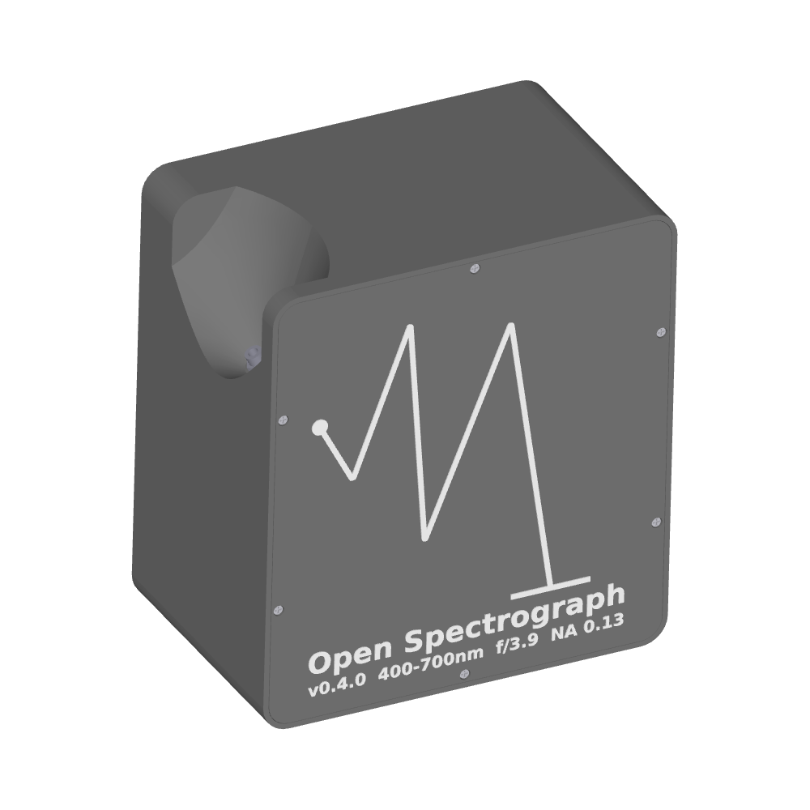
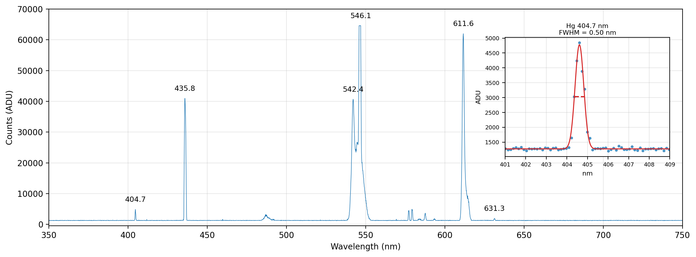

# Open Spectrograph

An open-source fiber spectrograph designed by evolutionary algorithm.
Printable housing, off-the-shelf optics, USB spectral data output.





## What is this?

A fixed-grating **Czerny-Turner fiber spectrograph** that takes light in
via SMA-905 fiber and outputs spectral data over USB. Cylindrical mirrors
for astigmatism correction, the same class of instrument as Ocean Optics
USB4000 and Flame.

The geometry generator is authoritative: the same code path the fitness
function traces is what gets exported as printable STEP files.

**Optical train (v0 — Thorlabs COTS):**
```
25 µm fiber (NA 0.12) → HASMA → F1 (cyl. fold) → M1 (cyl. collimator) → Grating (600 g/mm) → M2 (spherical camera) → TCD1304 CCD → USB
```

**Key specs:** ~15 nm/mm dispersion, 400-700 nm band, <1 nm resolution
(0.50 nm FWHM measured at 404.7 nm Hg line).

## Setup

```bash
# Clone the sibling solver repo
git clone https://github.com/dookaloosy/evolutionary-solver.git ../evolutionary-solver

# Bootstrap (creates .venv, installs everything)
./bootstrap.sh
source .venv/bin/activate

# Fetch third-party STEP files (detector board, not redistributable)
./fetch_vendor_steps.sh
```

## Usage

```bash
# Run tests
python -m pytest tests/

# Run the optimizer
python run_optimizer.py czerny --n_workers 12

# Export from baseline (layout diagram + CAD + STEP files + BOM CSV)
python export.py --baseline data/czerny_baseline_v0_design.toml --layout --cad --step

# Spot diagrams
python scripts/spot_panel.py --baseline data/czerny_baseline_v0_design.toml

# Build the paper (requires LaTeX)
./build_paper.sh
```

## Documentation

The full design narrative is in the paper (`open-spectrograph.tex`).
Pre-built PDFs are available on the [Releases](https://github.com/dookaloosy/open-spectrograph/releases) page.

Section sources in `docs/`:
- [Introduction](docs/01-introduction.md)
- [Design Principles](docs/02-design-principles.md)
- [Simulation](docs/03-simulation.md)
- [v0 Design (Thorlabs COTS)](docs/04-design-v0.md)

## License

Software (source code, scripts, simulation): [MIT](LICENSES/MIT.txt)
Hardware (STEP files, BOM, mechanical designs): [CERN-OHL-P v2](LICENSES/CERN-OHL-P-2.0.txt)

Third-party vendor STEP files are not included due to redistribution
restrictions. Optic solids are generated procedurally from BOM parameters.
Run `./fetch_vendor_steps.sh` for the detector and controller board STEPs
(CC BY-NC-SA 4.0 by Dr. Mitch Nelson).
