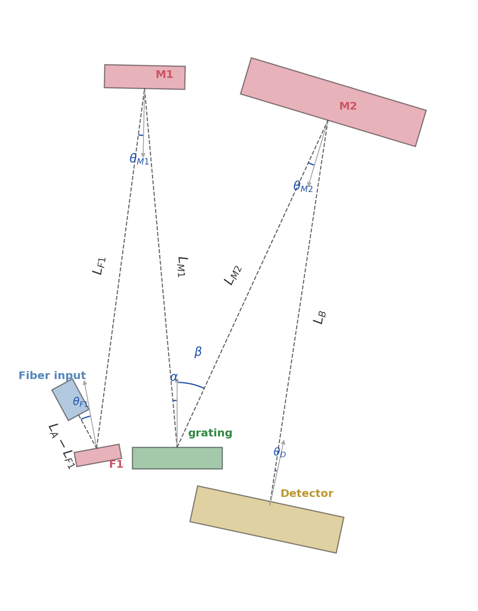

# 3. Simulation Framework

*We describe the non-sequential ray-tracing pipeline that evaluates candidate geometries for spot size and throughput, driven by a genetic algorithm searching over angles, distances, and discrete part selections.*

## 3.1 Approach

We exploit the analytical conditions from Section 2 to reduce the
design space: a genetic algorithm (GA) evolves the deviation angle, M1
off-axis angle, and BOM part selections, while the Shafer, Coddington,
and grating equations derive the remaining parameters. A coarse grid
sweep over the packaging variables (grating-to-mirror distances)
identifies feasible layout basins; Nelder-Mead then refines each basin
over arm lengths, fold angle, and detector tilt at full ray budget.
Physical constraints (mount clearances, beam-walk limits, throughput
floors) are enforced throughout. Every candidate satisfies coma
cancellation and focal-length conditions by construction; the search is
restricted to physically grounded configurations.

## 3.2 Simulation architecture

The simulation is structured as a pipeline with clean separation between
geometry description, physical simulation, and optimization:

```
TOML files
    |  Config and BOM definition
    v
Geometry
    |  Genome + parts → 3D element layout
    v
Scene
    |  Topology-agnostic element list
    |
    +──────────────────────────+
    |                          |
    v                          v
World builder              CAD builder
    |  Scene → raysect         |  Scene → build123d
    |  World (mm → m)          |  solids (mm-native)
    v                          v
Ray tracing                STEP export
    |  Forward trace           |  Housing, mounts,
    |  per fitness λ           |  optic solids
    v                          v
Fitness                    Manufacturing
    |  Mean RMS spot           geometry
    |  → scalar score
    v
Evolutionary solver
    |  Genetic algorithm + coarse sweep + optimization
```

All configuration is declarative: a BOM file (e.g.
`czerny_bom_v0_design.toml`) catalogs available parts, a baseline file
(`czerny_baseline_v0_design.toml`) specifies part selections and genome
parameters, and `defaults.toml` sets sweep parameters. Switching
`--bom` to a different catalog produces a different instrument class
without touching source code.

The geometry module (`CzernyGeometry`) is pure Python with no
ray-tracing or CAD dependencies; the raysect and build123d boundaries
are crossed only when building the traceable World or the solid-model
assembly, respectively. The same Scene that gets traced is exported as
CAD geometry, preventing drift between simulation and manufacturing.

## 3.3 Czerny-Turner geometry

The Czerny-Turner geometry is implemented as a single class
(`CzernyGeometry`, `designs/czerny_base.py`) that owns the four-phase
layout pipeline and handles all mirror types — spherical, cylindrical,
and off-axis paraboloidal — via internal branching on the BOM's
`mirror_type` field:

| Method | Spherical / Cylindrical | OAP |
|--------|-------------------------|-----|
| `mirror_axis()` | Surface normal | Grating direction (cylinder axis) |
| `mirror_params()` | `{}` | `{paraboloidal_focus_dir: ...}` |
| `constrain_genome()` | No-op | θ₁ = OAA₁/2, θ₂ = OAA₂/2 |

Cylindrical mirrors (tangential M1, sagittal F1) are handled in the
layout pipeline: `expand_genome()` derives the fold distance L_F1 from
the astigmatism-free condition (Xia 2017, eq. 14), and each element's
`cylindrical_orientation` flows from the BOM through `CzernyParts` to
the world builder and STEP exporter.



The Czerny-Turner layout is described by the following genome. All
angles are incidence angles (angle between the incoming ray and the
surface normal):

| DoF | Symbol | Description | Role |
|-----|--------|-------------|------|
| 1 | α | Grating incidence angle | Derived (grating eq. + gauge) |
| 2 | β | Grating diffraction angle | Derived (grating eq. + gauge) |
| 3 | θ_M1 | M1 incidence angle | GA-evolved |
| 4 | θ_M2 | M2 incidence angle | Derived (Shafer) |
| 5 | L_A | Slit to M1 distance | Derived (Coddington); NM-refined |
| 6 | L_B | M2 to detector distance | Derived (Coddington); NM-refined |
| 7 | L_M1 | Grating to M1 distance | Grid-swept; NM-refined |
| 8 | L_M2 | Grating to M2 distance | Grid-swept; NM-refined |
| 9 | θ_D | Detector tilt (CW from +z) | NM-refined (seeded at 0°) |
| 10 | θ_F1 | F1 fold incidence angle (optional) | GA-evolved; NM-refined |
| 11 | θ_F2 | F2 fold incidence angle (optional) | GA-evolved |
| 12 | L_F1 | M1 to F1 distance (optional) | Derived (eq. 14 or feasible-band midpoint) |
| 13 | L_F2 | M2 to F2 distance (optional) | Grid-swept |

DoFs 1–9 are always present; DoFs 10–13 are present only when fold
mirrors are active. Mirror positions are set by (α, L_M1) and
(β, L_M2) — the grating arm geometry. Slit and detector positions
are set by (θ_M1, L_A) and (θ_M2, L_B). When a fold mirror is
present, it is placed at distance L_F1 (or L_F2) along the
respective arm, deflecting the beam by 2·θ_F1 (or 2·θ_F2).

The decoupled parametrization — where mirror incidence angles
(θ_M1, θ_M2) are independent of grating arm angles (α, β) — is
essential. Earlier versions of the simulation coupled these
(θ = α), which prevented the optimizer from finding coma-canceling
configurations where the Shafer condition requires θ_M1 ≠ α.

Element positions are computed in four phases:

1. **Mirror positions** from grating arm angles and distances (α, β,
   L_M1, L_M2).
2. **Slit, detector, and fold-mirror poses** from incidence angles and
   arm lengths (θ_M1, θ_M2, L_A, L_B), with optional fold mirrors
   placed at (θ_F1, L_F1) and (θ_F2, L_F2) along each arm.
3. **Surface normals** from the law of reflection at each element.
4. **Element list assembly** with the complete beam-path ordering.

The grating sits at the origin with its nominal normal along +y. M1 sits
in the -x half-plane, M2 in the +x half-plane. All elements lie in the
xy plane (z = 0). The coordinate frame maps directly to raysect's
right-handed system.

### Grating reference orientation

The grating is fixed in the scene with its surface normal along +y. For a
given deviation angle Dv = α + β, the grating equation at the center
wavelength (550 nm) uniquely determines the individual angles α and β;
all other element positions are then derived relative to this fixed grating
orientation. The GA searches over the deviation angle Dv as a single free
parameter, and the grating equation resolves it into the incidence and
diffraction angles.

### Physics-seeded optimization

The optical conditions from Section 2 (Shafer coma cancellation,
the Coddington focal-length relations, the astigmatism-free condition
for cylindrical mirrors, and the grating equation) collectively
determine most of the design parameters from a small number of free
choices.
The GA evolves only the deviation angle and θ_M1; the remaining
parameters are derived analytically:

- α, β from the grating equation at the center wavelength, given the
  fixed grating orientation.
- θ_M2 from the Shafer condition, guaranteeing coma cancellation by
  construction.
- L_A, L_B from the Coddington tangential focal lengths, seeding the
  arm lengths at the correct focus.
- L_F1 from the astigmatism-free condition (eq. 14) for cylindrical
  folds, or the feasible-band midpoint for flat folds.

These seeds are not final values — they are physically motivated
starting points. The Nelder-Mead refinement stage is free to perturb
L_A, L_B, and θ_D away from their analytical seeds, allowing the
optimizer to trade coma cancellation against astigmatism correction
against detector tilt as the ray-traced fitness function dictates. The
physics-based derivation ensures that every candidate starts in a physically
reasonable region of the design space; the ray tracer then determines
whether the local optimum departs from the analytical prediction.

The grating-to-mirror distances (L_M1, L_M2) are packaging variables
that do not affect imaging in the collimated space between M1 and M2.
L_M1 is bounded below by mount clearance; L_M2 is bounded above by M2
beam walk. Both are swept on a coarse grid to find mount-feasible
layouts. A 2-D polygon collision check (Separating Axis Theorem on
convex polygons in the xy plane) rejects layouts where optic bodies
overlap, where a mount foot intrudes into a beam-cone segment, or
where mount feet overlap each other.

### Detector tilt

The detector plane can be rotated around the z axis (CCD height axis)
by `theta_d_deg`. Positive tilt is clockwise viewed from +z,
moving the long-wavelength (red) end of the array farther from M2.
Tilting the detector balances the tangential and sagittal focal lengths
across the band: at the blue end the tangential focus dominates, at
the red end the sagittal focus dominates, and the tilt shifts the
effective M2-to-detector distance per wavelength to minimize the
worst-case RMS spot radius.

Detector tilt is refined by Nelder-Mead rather than derived analytically
or evolved by the GA. The initial simplex seeds θ_D at 0° with a
minimum 1.0° absolute step, giving the optimizer room to explore tilt
in both directions. The Xia 2017 validation confirmed that Coddington
predicts arm lengths accurately (L_A, L_B shifts < 0.2 mm), but detector
tilt moved from 0° to 3.5° — the dominant degree of freedom in the
refinement stage.

## 3.4 Scene and World builder

The core data structure is the `Scene`: an ordered list of `ElementPlacement`
objects, each specifying an optical element's label, kind (mirror, grating,
slit, detector), position, optical axis, and a params dict carrying
element-specific data (focal length, groove density, reflectance, etc.).

```python
@dataclass(frozen=True)
class ElementPlacement:
    label: str          # "M1", "grating", "entrance_slit", etc.
    kind: str           # "mirror", "grating", "slit", "detector"
    position: Vec3      # (x, y, z) in mm, z=0 for in-plane elements
    axis: Vec3          # optical axis (unit vector, disk/cylinder axis)
    params: dict        # element-specific: focal_length_mm, groove_density, ...
```

The scene is layout-independent — it knows nothing about Czerny-Turner
specifically. A Czerny-Turner geometry module produces a scene; a future
Rowland-circle or Littrow module would produce a different scene with the
same structure. Downstream modules (world builder, metrics, export) consume
scenes without knowing which topology created them.

### World builder and custom materials

The world builder translates a Scene into a raysect World, converting all
coordinates from millimeters to meters (the mm-to-m boundary is a single
constant, `MM_TO_M = 1e-3`).

Each optical element is realized as a raysect primitive with a custom
material:

- **Spherical mirrors**: `SphericalMirror` / `TabulatedSphericalMirror` —
  specular reflection from a sphere-cylinder CSG. Tabulated variants
  interpolate wavelength-dependent reflectance from vendor CSV data.
- **Cylindrical mirrors**: `CylindricalMirror` /
  `TabulatedCylindricalMirror` — specular reflection from a cylinder
  with curvature in one axis only. Used as a tangential collimator
  (M1) or sagittal fold (F1) in the aberration-corrected CT configuration.
- **Flat fold mirrors**: `FlatMirror` / `TabulatedFlatMirror` —
  specular planar reflector for beam folding.
- **Blazed diffraction grating**: `BlazedGrating` /
  `TabulatedBlazedGrating` — first-order (m=−1) diffraction only.
  Tabulated variant interpolates wavelength-dependent efficiency from
  vendor CSV data. Non-design orders (m=0 specular, m=±1 wrong-side,
  m=±2) are zeroed — no validated per-order efficiency model exists.
  The scalar sinc² envelope in `BlazedGrating` handles angular
  dependence correctly for multi-order work, but
  `TabulatedBlazedGrating` previously applied flat scale factors
  that overstated non-design orders by up to 43×.
- **Hit recorder**: `HitRecorder` — transparent `Material` subclass
  that records ray intersection positions without absorbing the ray.
  A tight-fitting box encloses each optic; incoming rays are logged
  on entry and reflected rays exit the box without being re-counted.
  All hits — including stray light — are scored; there is no
  bounce-depth filter in the default evaluation path.

The entrance aperture is modelled as a uniform-radiance emitter matching
the fiber's numerical aperture (NA 0.12) and core diameter (25 µm).

## 3.5 Scene and CAD builder

The same Scene that passes fitness evaluation is exported as manufactured
geometry via build123d, a Python CAD framework built on the OpenCascade
BREP kernel. Both consumers — raysect for ray tracing, build123d for
solid modeling — read from the same BOM definitions and Scene layout,
so the manufactured geometry is guaranteed to match what was simulated. Housing
geometry, mount footprints, beam-cone quads, wall keep-outs, and
endmill-radius fillets are all generated procedurally from the optical
layout and rebuild automatically when the optical train changes.

The manufactured output is a single 3D-printed housing that serves as
both structural chassis and light-tight enclosure. Optic mounts bolt to
the housing floor via screws; the HASMA fiber adapter threads into the
entrance wall via a 1/4"-36 tapped hole (tap drill printed, tapped
post-print with a conical tap guide fixture). Each mount integrates
two-axis adjustment: pitch via a living-hinge flexure at the rear wall,
and roll via a 2-bladed leaf-spring cross-pivot section (virtual pivot
at the optic centre) for cylindrical axis alignment. The pitch hinge
foot is trimmed at 2° to preload the flexure; the roll flexure is
actuated by a pair of setscrews through heat-set inserts in the foot.
Captive TPU contact bumps provide three-point optic retention; the top
setscrew preloads the optic against the two bottom bumps. Three mount
types cover the optical train: mirror (round), grating (square), and
OAP (plate with hex bolt pattern).
When no vendor STEP file is registered for a given optic, the exporter
generates a procedural solid from the BOM's geometry parameters (radius
of curvature, diameter, thickness) using build123d CSG primitives —
sphere-cylinder intersections for spherical mirrors, cylinder-cylinder
for cylindrical mirrors, and so on.

The CAD builder translates each Scene element into sketch-driven
`BuildPart` constructions. Unlike the world builder, which converts
millimeters to meters at the raysect boundary, the CAD builder works in
millimeters natively — matching the BOM and STEP conventions. Two output formats are produced:
**STEP** (optic solids, flexure mounts, and unibody housing assembled in
their design-time poses) and **PNG** (raysect-rendered scene
visualization with physically accurate lighting).

## 3.6 Forward ray tracing

The spectrograph simulation uses forward ray tracing exclusively for
design evaluation. Rays are launched from the entrance aperture into
the f/# cone and propagated through the optical train in the physical
direction — fiber to mirrors to grating to detector.

The evaluation pipeline proceeds in stages of increasing computational
cost: an analytical pre-filter rejects candidates where fitness
wavelengths miss the CCD (zero ray cost); a 2-D polygon collision
check rejects overlapping optics and beam-cone clipping (zero ray
cost); a coarse grid sweep traces 1,000 rays per wavelength to map
the (L_M1, L_M2) landscape; and Nelder-Mead basin refinement traces
5,000 rays per wavelength to polish arm lengths and detector tilt.
Each stage eliminates infeasible or low-quality candidates before the
next stage invests further computation. The following subsections
describe the forward-trace model, the tiered pipeline in detail, and
the diagnostic spot-diagram mode.

### 3.6.1 Forward-trace model

For each fitness wavelength, rays are launched from the entrance slit
through the fixed-grating optical train. At the detector position, an
oversized transparent `HitRecorder` overlay captures ray intersections
without absorbing light — rays pass through unattenuated and continue
to interact with optics beyond it. The raysect scene includes mount
fixtures as Lambert-material CSG objects (mirror flexure mounts,
grating jaw mounts, fold mirror mounts), so mount shadows — such as a
fold mirror mount partially occluding the grating-to-M2 beam — are
naturally scored through reduced geometric hit counts.

The forward trace measures the following quantities per wavelength:

- **RMS spot radius** (um): `spot_decomposition()` computes the 2D
  RMS spot radius from all hits on the oversized recorder (not
  aperture-filtered). This is the fitness target — the
  industry-standard metric for optical imaging quality.
- **Spot decomposition diagnostics** (reported, not in fitness):
  tangential RMS (`sigma_x`, drives spectral resolution), sagittal
  RMS (`sigma_y`, astigmatism signature), sagittal/tangential ratio
  (>1 = astigmatism-dominated, <1 = coma/SA-dominated), and
  tangential skewness (nonzero = coma, ~0 = spherical aberration).
- **Throughput**: `(hits_in_aperture / rays_launched) × material_factor`,
  where `material_factor` is the cumulative wavelength-dependent
  reflectance/efficiency product through the optical train (mirror
  reflectance from vendor CSV, grating efficiency from vendor CSV).
  The geometric hit count captures all vignetting losses (grating
  overfill, M2 beam walk, detector-plane overshoot) naturally — rays
  that miss any element simply don't reach the detector. Throughput
  is not in the fitness — it is enforced as a constraint via the
  `min_throughput` acceptance gate (0.5% floor).
- **ILF FWHM** (nm): derived from the beam footprint diagram by
  binning the hit distribution along the dispersion axis at the
  TCD1304's 8 um pixel pitch, with FWHM via half-max crossing
  interpolation. Not computed during the GA; used for
  post-optimization analysis only.
- **Flux proxy** (watts): `throughput × P_collected`, for compatibility
  with legacy metrics. `P_collected` is the entrance-aperture power
  within the f/#-matched collection cone.

The oversized recorder is central to the forward-trace approach: there
is no analytical wavelength-to-pixel mapping, no sign convention to get
wrong, and no tiny observer to position. All light reaching the detector
plane is captured regardless of where it lands.

Stray light is scored, not filtered: all rays reaching the detector
contribute to the RMS spot regardless of bounce depth. Rays that
bypass the optical train (e.g. beam overfilling an undersized grating
and scattering to random detector positions) inflate the RMS,
naturally penalizing designs with poor stray light rejection. A
legacy bounce-depth filter (`filter_stray=True`) is available for
diagnostic use but disabled by default.

### 3.6.2 Tiered evaluation pipeline

The forward trace is wrapped in a multi-stage pipeline that balances
speed against fidelity:

**Tier 1: Analytical pre-filter.** Before any raysect world is built,
a single analytical gate rejects infeasible candidates with zero ray
cost. `wavelengths_on_detector()` checks whether each fitness wavelength
(450, 550, 650 nm) lands on the CCD array — pure math from the grating
equation and reciprocal linear dispersion. Candidates where any fitness
wavelength falls off the detector are rejected immediately.

M2 vignetting is intentionally not gated. The forward trace scores
partial vignetting naturally through reduced geometric hit counts,
giving the GA a continuous throughput gradient to optimise the beam-walk
tradeoff. An analytical vignetting gate would impose a binary
accept/reject boundary that prevents the GA from exploring geometries
with moderate vignetting but favorable overall fitness.

**Tier 2: Forward trace.** The forward-trace model described above, run
at two ray budgets depending on the evaluation stage. Coarse sweeps use
1,000 rays per wavelength (3k total per grid point) during the search
over (L_M1, L_M2); basin refinement (Nelder-Mead over arm lengths and
detector tilt) uses 5,000 rays per wavelength (15k total) for the higher
fidelity required when polishing continuous parameters near a local
minimum. Configuration: `coarse_forward_rays` and `forward_rays` in
`defaults.toml` `[sweep]`.

### 3.6.3 Spot-diagram diagnostics

The same forward-trace engine generates per-surface spot diagrams for
design analysis. Rays are launched from the entrance aperture into the
f/# cone and propagated through the optical train. At each surface,
a tight-fitting hit-recording box encloses the element, and the
spatial distribution of ray intersections is recorded.

These spot diagrams reveal:

- Beam footprint on each element (does the beam overfill the optic?)
- Aberration patterns (coma tails, astigmatic elongation)
- Vignetting at the grating (footprint shift with wavelength)
- Image quality at the detector plane

## 3.7 Fitness function

The per-wavelength metrics are averaged into a single fitness score:

    fitness = mean over λ of (rms_spot_λ)    [microns]

Lower is better. The fitness target is the arithmetic mean of
per-wavelength RMS spot radii on the detector plane. RMS spot
captures all aberrations (coma, astigmatism, spherical aberration)
in a single rotation-invariant metric without assuming which axis
matters more.

The mean formulation balances overall spot quality across the band
without over-penalizing band-edge outliers. This was validated
against Xia 2017: optimising mean(RMS) finds a detector tilt of
≈ +4°, matching Xia's Zemax-optimized θ_D = 3.5°. The alternative
minimax formulation (max over λ) produces tilt ≈ +12° — equalising
the band edges but at the cost of degraded center-band performance.

Throughput is enforced as a constraint, not an optimization target:
the sweep engine's acceptance gate rejects candidates where the
worst-wavelength throughput falls below 0.5% (`min_throughput <
acceptance_threshold`). This separates what is optimised (spot
quality) from what is required (adequate light collection), following
standard optical design practice.

Infeasible candidates — those that fail pre-trace validation gates —
are assigned a penalty fitness of 10^6 without being traced, saving
computation. Hard gates: mount-to-mount collision (convex hull of
T-shaped foot outline, checked all-pairs across M1_mount, M2_mount,
grating_mount, F1/F2_mount; slit and detector use wall-boundary
polygons from the BOM), beam-cone clipping (checked against both
optic bodies and mount slab polygons; only endpoint mounts are exempt,
adjacent-element mounts are checked), slit-on-perimeter (entrance slit
outside convex hull of other elements), and footprint envelope.
Beam-cone wall clipping is checked when housing is built. Partial
vignetting from mount shadows (e.g. fold mirror mount occluding part
of the grating→M2 beam) is not hard-gated — the forward trace scores
it through reduced hit counts, providing the GA a gradient rather than
a binary reject.

## 3.8 Evolutionary optimization

The optimization uses the GA engine from the `evolutionary-solver`
library, which provides the population management, coarse grid sweep,
and Nelder-Mead basin refinement stages. The GA searches a 2D
continuous space (deviation angle Dv, θ_M1) plus discrete BOM part
selection. User-specified performance targets (resolution, bandwidth,
f-number, center wavelength) drive BOM filtering at startup; only
valid part combinations enter the search.

### Design targets

Four performance targets define the instrument requirements. Default
values live in `czerny_targets.toml`; CLI flags override per-run:

- `--max_rld <nm/mm>`: maximum reciprocal linear dispersion (coarsest
  acceptable). Rejects M1 with `f_coll < d_grating / max_rld`.
  Finer dispersion always passes.
- `--min_bw <nm>`: minimum bandwidth on detector. Rejects M2 with
  `f_cam > L_det * d_grating / min_bw`. Wider bandwidth always
  passes. Also sets fitness wavelengths.
- `--max_fnum <float>`: maximum f-number (slowest acceptable). Rejects
  M1 with `D < f_coll / max_fnum`. Faster optics always pass.
  D_M2 is derived from D_M1 plus beam walk across the bandpass.
  The fiber NA gives a natural reference (f/4.2 for NA = 0.12).
- `--center <nm>`: design center wavelength (grating lock point).

These directly specify the optical performance targets; BOM parts
are resolved by constraint satisfaction from the full BOM options
tables.

### Search space

**GA-evolved** (2D continuous, mutated between generations):

- **Deviation angle**: angle between entrance/exit arms at the grating.
  Affects spot quality through the Shafer cascade (α, β → θ₂ →
  astigmatism), beam walk on M2, and anamorphic magnification. The
  grating efficiency model has no angular dependence (vendor CSV is
  wavelength-only), so the efficiency channel is not scored — but
  aberration and geometry effects are captured by the forward trace.
  Range: [10°, 45°].
- **θ₁** (M1 off-axis angle): controls compactness vs astigmatism.
  Bounded below by mount clearance, above by astigmatism budget.

**Derived** (computed per candidate inside `expand_genome()`):

- α, β from grating equation + deviation + center wavelength
- θ₂ from Shafer coma-cancellation condition
- L_A, L_B from Coddington tangential focal length
- L_M2: maximum distance at which the grating image is completely
  contained in M2 across the entire bandpass (beam walk limit)
- L_M1: minimum distance clearing mounts and beam cones
- D_M1: f_coll / fnum
- D_M2: D_beam + 2 × beam_walk (checked per candidate)
- Fold geometry from layout solver (feasibility, not fitness)

**Pre-validated combo list** (computed at startup):

`resolve_from_specs()` applies tight heuristics (RLD, BW, f/#,
D_grating~D_M1, D_M2>D_M1, exact CCD coverage, D_F1≤D_M1,
f_F1≤f_M2) to produce a small set of valid BOM combos. Each
combo is assigned a combo_id. Invalid combos are rejected before
the GA starts — no wasted evaluations.

**Basin refinement** (Nelder-Mead):

After the coarse phase identifies promising (combo_id, deviation,
θ_M1, θ_F1) candidates, Nelder-Mead polishes (L_M1, L_M2, L_A, [θ_F1],
L_B, θ_D) seeded from the physics-based derivation. When fold_mode=F1,
θ_F1 is varied and L_F1 is re-derived from the astigmatism-free
condition each evaluation.  The initial simplex uses a minimum 1.0
absolute step per dimension so θ_D (seeded at 0°) is explored. Xia 2017
showed detector tilt is the dominant refinement (0° → 4.3°), while
Coddington predicts L_A/L_B within 0.2 mm. The NM is free to perturb
all variables from their cascade values. Two guards prevent
degenerate solutions: (1) candidates where the astigmatism-free
condition (eq. 14) is infeasible receive penalty fitness without
NM evaluation — the foldless scene the coarse grid evaluated is
not a valid design; (2) a throughput floor inside the NM objective
rejects evaluations where `min_throughput` drops below the
acceptance threshold, preventing drift into zero-throughput
configurations.

### Evaluation flow

Each candidate evaluation proceeds as:

1. GA proposes (combo_id, deviation, θ_M1, [θ_F1]).
2. `prepare()` maps combo_id to part names and loads CzernyParts.
3. `expand_genome()` derives θ_M2 (Shafer), α/β (grating equation),
   L_A/L_B (Coddington), L_F1 (eq. 14 for cylindrical F1,
   feasible-band midpoint for flat F1).
4. Coarse sweep over (L_M1, L_M2) — each grid point:
   a. Analytical pre-filter rejects candidates where any fitness
      wavelength falls off the CCD (§3.6.2).
   b. Forward trace at 1k rays/λ; acceptance threshold (0.5%
      minimum throughput) rejects low-throughput grid points.
5. Basin extraction identifies promising (L_M1, L_M2) regions from
   the accepted grid points.
6. Nelder-Mead refines each basin over (L_M1, L_M2, L_A, [θ_F1],
   L_B, θ_D) at 5k rays/λ, seeded from the Coddington tangential
   focal lengths. θ_F1 is varied and L_F1 re-derived each
   evaluation. Basins where the fold placement is infeasible
   receive penalty fitness without NM evaluation.
7. Best basin's fitness becomes the candidate's score.

The GA defaults to point-source evaluation (`--point_source`). When
the extended source is used instead, the 25 µm fiber convolution
dominates the tangential spot width, masking the aberration differences
between candidates; the optimizer loses sensitivity to optical quality
and converges on layouts that minimize sagittal extent rather than
tangential resolution. Point-source evaluation isolates the aberration
structure, allowing the GA to select for the optical merit that matters
once the slit image is convolved in post.

## 3.9 Validation

We validated the simulation pipeline against Xia *et al.* (2017), who
published Zemax-computed RMS spot diagrams for both a standard and an
aberration-corrected CT spectrometer (350-750 nm, 600 g/mm, 25 µm
slit, f/5). All validation results were obtained with a point source (no
fiber convolution), matching Xia's Zemax configuration. The validation
has three parts: (a) forward-trace reproduction of their standard CT
geometry, (b) Nelder-Mead refinement of their aberration-corrected CT,
and (c) independent GA convergence to the same performance class.

### 3.9.1 Standard CT: forward-trace match

Xia's standard CT (R_M1 = 224 mm, R_M2 = 220 mm, θ_D = 3.5°) is
encoded as a BOM (`czerny_bom_xia2017_standard.toml`) and baseline layout
(`czerny_baseline_xia2017.toml`). Sections 3.9.1 and 3.9.2 are
produced by a single script:

```
python scripts/validate_xia2017.py
```

Our forward-trace results were:

| λ (nm) | Our RMS (µm) | Xia Fig 5a (µm) | Difference |
|--------|-------------|-----------------|------------|
| 350 | 105.7 | 101.5 | +4% |
| 450 | 132.8 | 132.6 | +0.1% |
| 550 | 179.2 | 180.8 | −1% |
| 650 | 246.1 | 248.9 | −1% |
| 750 | 335.8 | 336.8 | −0.3% |
| **mean** | **199.9** | **200.1** | **−0.1%** |

All five wavelengths agreed within 5%, confirming that our
forward-trace simulation reproduces Zemax results when given identical
geometry.

### 3.9.2 Aberration-corrected CT: Nelder-Mead refinement

Xia's aberration-corrected CT replaces the flat fold with a sagittal
cylindrical mirror (R_F1 = 20 mm) and converts the collimator to
tangential cylindrical (R_M1 = 224 mm). This BOM is encoded in
`czerny_bom_xia2017_corrected.toml`. The following parameters were held fixed
(constrained by Xia's geometry):

| Parameter | Value |
|-----------|-------|
| α | 5.16° |
| β | −24.84° |
| θ_M1 | 6.4° |
| θ_M2 | 8.1° |
| θ_F1 | 18.0° |
| L_A | 111.30 mm |

At Xia's reported layout values, our simulations showed RMS spot size
asymmetry at the edge wavelengths, suggesting the presence of residual
aberrations. We ran a Nelder-Mead optimization over the
remaining free parameters (L_F1, L_B, θ_D):

| Parameter | Value | Xia notation | Xia Table 2 | Shift |
|-----------|-------|--------------|-------------|-------|
| L_A − L_F1 | 10.531 mm | l_SM1 | 10.526 mm | +0.005 mm |
| L_F1 | 100.771 mm | l_M1M2 | 100.774 mm | −0.003 mm |
| L_B | 108.872 mm | l_M3D | 108.751 mm | +0.121 mm |
| θ_D | 4.30° | θ_D | 3.50° | +0.80° |

The fold distance shifted by only 0.005 mm, confirming that the
astigmatism-free condition tightly constrains the fold placement. The
per-wavelength RMS spots before and after optimization were:

| λ (nm) | Before optimization (µm) | After optimization (µm) | Xia Fig 5b (µm) | Difference |
|--------|-------------------------|------------------------|-----------------|------------|
| 350 | 12.2 | 15.3 | 16.7 | −9% |
| 450 | 6.5 | 8.1 | 8.2 | −1% |
| 550 | 4.5 | 7.2 | 4.4 | +63% |
| 650 | 11.9 | 7.3 | 9.0 | −19% |
| 750 | 28.5 | 15.6 | 16.9 | −8% |
| **mean** | **12.7** | **10.7** | **11.0** | **−3%** |

After optimization the mean RMS agreed with Xia's result within 3%
and the band-edge asymmetry collapsed (750 nm: 28.5 → 15.6 µm), but
at the cost of the center wavelength: 550 nm degraded from 4.5 to
7.2 µm (+63% above Xia's 4.4 µm). The source of the per-wavelength
discrepancies remains unresolved.

### 3.9.3 Aberration-corrected CT: GA convergence

We ran the full GA pipeline against Xia's aberration-corrected CT BOM
without constraining the deviation angle or mirror incidence angles:

```
python run_optimizer.py czerny \
    --bom data/czerny_bom_xia2017_corrected.toml \
    --max_rld 17 --min_bw 400 --max_fnum 5 --center 550 \
    --fold_mode F1 --pop_size 128
```

The run converged in 11 generations (128 candidates each, point source,
350–750 nm bandwidth). The GA independently discovered a different
angular configuration (saved as
`czerny_baseline_xia2017_evolved.toml`):

| Parameter | Xia Fig 5b | GA winner |
|-----------|------------|-----------|
| α | 5.2° | 3.20° |
| β | −24.8° | −22.70° |
| θ_M1 | 6.4° | 10.2° |
| θ_M2 | 8.1° | 12.2° |
| θ_F1 | 18.0° | 34.0° |
| θ_D | 3.50° | 4.92° |
| L_A | 111.30 mm | 104.27 mm |
| L_F1 | 100.77 mm | 92.22 mm |
| L_A − L_F1 | 10.53 mm | 12.04 mm |
| L_B | 108.75 mm | 114.17 mm |
| L_M1 | — | 91.53 mm |
| L_M2 | — | 86.74 mm |

The per-wavelength RMS spots at the three fitness wavelengths were:

| λ | Xia Fig 5b | GA winner | Difference |
|--------|------------|-----------|------------|
| 350 nm | 16.7 µm | 18.7 µm | +12% |
| 550 nm | 4.4 µm | 6.3 µm | +43% |
| 750 nm | 16.9 µm | 24.1 µm | +43% |
| **mean** | **12.7 µm** | **16.4 µm** | **+29%** |

Crucially, the GA was subject to a packaging constraint absent from
Xia's Zemax model: the TCD1304 PCBA (70 × 40 mm) collides with the
grating mount at Xia's arm lengths. The GA resolved this by
steepening the mirror incidence angles (θ_M1: 6.4° → 10.2°;
θ_M2: 8.1° → 12.2°), splaying the beam path to clear the board.
Steeper mirrors increase off-axis astigmatism
(Δf ∝ sin²θ / cosθ), and consequently the fold must compensate:
θ_F1 steepens from 18° to 34°, with L_F1 following from eq. 14. The
mean RMS (16.4 µm vs Xia's 12.7 µm) remains an order of magnitude
better than the 200 µm standard CT, confirming that the GA converges
to the correct performance class while respecting physical packaging
constraints that a pure optical optimization would not encounter.
